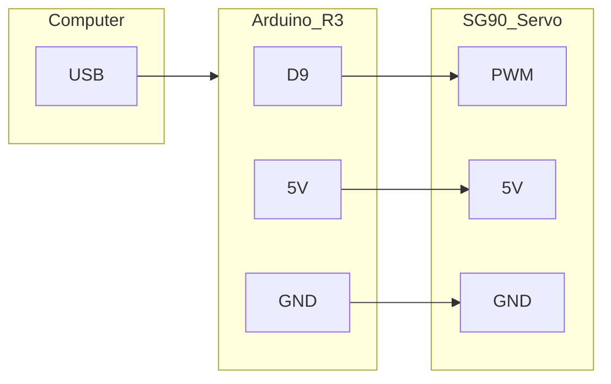

# Protocol specificatie single axis robot arm

## Hardware

De robot arm bestaat uit de volgende hardware:

- [Arduino Uno](https://store.arduino.cc/products/arduino-uno-rev3)
- [SG90 Servo](https://www.kiwi-electronics.com/en/micro-servo-sg90-1-8kg-cm-9g-3018)
## Connectie

De kleuren van de bedrading van de SG90 servo hebben de volgende pinout:

 - GND bruin
 - VCC rood
 - PWM oranje

Connect de SG90, PC, en Arduino volgens de volgende pinout:

## Protocol Specificatie

1. **Baud Rate:**
    - De baud rate moet worden ingesteld op 9600.
2. **Commandostructuur:**
    - Een commando bestaat uit twee delen, gescheiden door een dubbelepunt (`:`):
        - "deg": De waarde voor de hoek (0 tot 180 graden).
        - "speed": Snelheid per grade (0 tot 100). 
3. **Commando-indeling:**
    - Het volledige commando heeft de volgende structuur: `deg:180speed:100`
4. **Commando-einde:**
    - Elk commando moet eindigen met een newline-karakter (`\n`).
5. Acceptatie-response:
	- Als het commando in goede handen is ontvangen zal de Arduino de response `Ok` terugsturen.

 